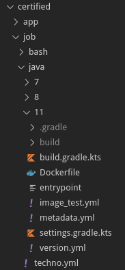

# Saagie Technologies

[][releases] 
[][releases]  

[][build_promote] [][build_modified]

[][issues]

[][license]

[][contributors]

This repository contains all official technologies shipped by Saagie.

## CONTENTS

This repository contains all job and application technologies.

This is a recommended files and CI structure for Saagie SDK Technologies.  
You can use another structure. See [Saagie Help Center documentation][saagie-help-center] for more information.

 
## CONTRIBUTING

All contributions are made with the pull-request system.  

You create an issue and a pull-request associated. 

The build is running using a Github Action workflow ([build only modified][build_only_modified]). It builds only technologies modified and generates a pre-release containing assets.  
The name of the pre release = current version + name of the branch.

### How to create or edit a job technology or context

When you create a new technology or a new context for a job, you need to specify some mandatory files (see current for inspiration).

Tree directories are strict :   

We split job and app inside a "technologies" directory (root level).

Inside "job" or "app", each technology is under a folder (here : "java"), then each sub directories represents a context of this technology (here : 7,8,11 and 13 which was for all contexts of java.)

#### Technology level : 

filename |  description
--- | ---
`techno.yml` |  This file describes the technology (see [Saagie Help Center documentation - SDK][saagie-help-center] for details).
`metadata.yml` |  This is a **generated** file, it will be created during the first build. It's just a concatenation of the `techno.yml` and all `context.yml` files with a correct Docker image tag (from `dockerInfo.yml`). **Don't modify it manually.**

#### Context level : 

filename |  description
--- |  ---
`context.yml` | This file describes all information about the context (see [Saagie Help Center documentation - SDK][saagie-help-center] for details).
`dockerInfo.yml` | This is a **generated** file containing the Docker repository and tag of the context Docker image. **Don't modify it manually.**
`build.gradle.kts` | The build in this repository is made with [gradle plugins][saagie-gradle-plugin]. So you need to apply theses plugins (just need a Dockerfile and a image_test.yml). You can also declare dependencies between build if you need to build this context from another in this repository (Gradle will do the build using this dependency).
`settings.gradle.kts` | To set a name of the build context (need to be uniq in this repository).
`Dockerfile` | The Dockerfile of the context
`image_test.yml` |  Each build need to be tested ... So we use [GoogleContainerTools/container-structure-test](https://github.com/GoogleContainerTools/container-structure-test) to test the generated Docker image.

If you don't have a Dockerfile (example : `generic/docker` technology), only the `context.yml` is mandatory.

### How to create or edit an application technology

For the moment, we just host metadata.yml for each app in this repository (we use external git repositories for Docker images).

The content of the `metadata.yml` file is describe in the [Saagie Help Center documentation - SDK][saagie-help-center].

## Build

We use a custom [Gradle plugin][saagie-gradle-plugin] to build and ship all Docker images. We use Github actions to call all Gradle tasks (on CI).

### Local

Just run `./gradlew localBuildModifiedJobs --parallel -Dversion.buildmeta=local`  
and it will build all modified images without push it with the "_local" suffix.

### Github Action

The workflow starts at each push on the branch ... and it generates Docker images for modified technologies and generate a pre-release in Github containing all generated metadata files in a zip.

### Promotion

When the pull-request is merged in master, another Github action (using a Gradle task) starts. It will retag Docker images with branch name into a "production" name and generate a real release (and delete the pre release).

### Sequence Diagram

Here is a more detailed sequence diagram: ![Sequence Diagram][ci-sequence-diagram]

[ci-sequence-diagram]: technologies-CI.png
[saagie-gradle-plugin]: https://github.com/saagie/technologies-plugin
[saagie-help-center]: https://saagie.zendesk.com/hc/en-us
[build_only_modified]: https://github.com/saagie/technologies/blob/master/.github/workflows/buildOnlyModified.yml
[releases]: https://github.com/saagie/technologies/releases
[contributors]: https://github.com/saagie/technologies/graphs/contributors
[issues]: https://github.com/saagie/technologies/issues
[license]: https://github.com/saagie/technologies/blob/master/LICENSE
[build_promote]: https://github.com/saagie/technologies/actions?query=workflow%3APROMOTE
[build_modified]: https://github.com/saagie/technologies/actions?query=workflow%3A%22BUILD+ONLY+MODIFIED%22